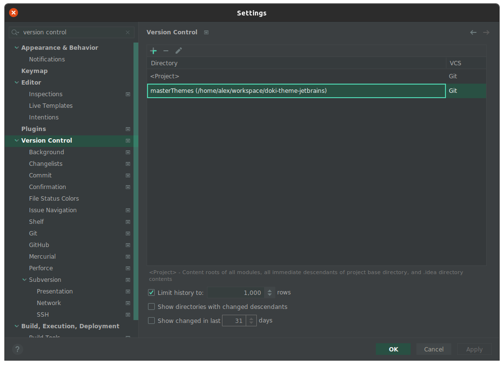

Contributing
---

# Outline

- [Build Process](#build-process-high-level-overview)
- [Editing Themes](#editing-themes)
- [Creating New Themes](#creating-new-themes)

# Build Process High level overview

I won't go into the minor details of the theme building process, however I will talk about the high level details of
what is accomplished.

All themes have a base template that they inherit from. Themes have the ability to choose their inherited parent. Each
child has the ability to override any attributes defined by the parent. This mitigates any one-off issues for themes
that are captured by the global shared style.

# Editing Themes

## Editing Themes Required Software

- Java 11
- IntellIJ 2020.3+

## Editing Themes Setup

**Get the Master Themes**

Since this theme suite expands across multiple platforms, in order to maintain consistency of the look and feel across
platforms, there is a [central theme definition repository](https://github.com/doki-theme/doki-master-theme)

This repository needs to be cloned as a directory called `masterThemes`. If you are running Linux/MacOS, you can
run `getMasterThemes.sh` located at the root of this repository. This script does exactly what is required, if you are
on Windows, have you considered Linux? Just kidding (mostly), you'll need to run this command

```shell
git clone https://github.com/doki-theme/doki-master-theme.git masterThemes
```

Once that is done, for extra points, you can register the `masterThemes` directory, in Intellij, as another VCS root.



## Running Plugin

The [Gradle IntelliJ Plugin](https://github.com/JetBrains/gradle-intellij-plugin#gradle-intellij-plugin) does all of the
heavy lifting for us. Here is the complete list
of [tasks supplied by the plugin](https://github.com/JetBrains/gradle-intellij-plugin#tasks).

Here is the list of all gradle tasks I use from that plugin.

- `buildPlugin`
- `runIde`
- `verifyPlugin`

The important task for this step is `runIde`
, [here is how to run gradle tasks in the IDE](https://www.jetbrains.com/help/idea/work-with-gradle-tasks.html#gradle_tasks)
.
**Note**: I choose the `gradlew` option. You can also do it via the command line, just use the gradle wrapper.

```shell
./gradlew runIde
```

If that doesn't work for some reason, it may because you cannot run IntelliJ Idea Ultimate. You can give in and purchase
the IDE, or you can temporarily change the IDE run by the gradle plugin. This can be done by changing
the [IntelliJ platform properties used](https://github.com/JetBrains/gradle-intellij-plugin#intellij-platform-properties)
, more specifically the `type`. There is a `gradle.properties` file that contains an `IU`, just change that to `IC`. Run
the `runIde` command again, and you should be good!

## Theme Editing Process

I have too many themes to maintain manually, so theme creation/maintenance is automated and shared common parts to
reduce overhead.

The standardized approach used by all the plugins supporting the Doki Theme suite, is that there is a `buildSrc`
directory.

Inside the `buildSrc` directory, there will be 2 directories:

- `src` - holds the code that builds the themes.
- `assets` - defines the platform specific assets needed to build the themes. This directory normally contains two child
  directories.
  - `themes` - holds the [application definitions](#application-specific-templates)
  - `templates` - if not empty, normally contains various text files that can be evaluated to replace variables with
    values. Some cases, they also contain templates for evaluating things such as look and feel, colors, and other
    things.

### JetBrains Themes specifics

There are two important pieces that compose a theme:

- `theme.json` - which defines the look and feel of the IDE. The panels and stuff that isn't code.
- `editor_scheme.xml` - which defines the colors and such for the code editor (and also various look and feel components
  which is annoying sometimes).

See [creating a custom UI theme for more details](https://plugins.jetbrains.com/docs/intellij/themes.html#creating-custom-ui-themes)
.

Here is another
good [resource for customizing themes](https://github.com/one-dark/jetbrains-one-dark-theme/discussions/206#discussioncomment-368647)

### Submitting PR

This is an [example of editing existing themes](https://github.com/doki-theme/doki-theme-jetbrains/pull/391).

# Creating New Themes

## Creating Themes Required Software

- [Editing Themes required software](#editing-themes-required-software)
- Yarn package manager
- Node 14

## Setup

Follow the [editing themes setup](#editing-themes-setup)

**Get the assets repository**

Clone the [doki-theme-assets](https://github.com/doki-theme/doki-theme-assets) repository in the same parent directory
as this plugin's repository.

Your folder structure should look like this:

```
your-workspace/
├─ doki-theme-jetbrains/
│  ├─ masterThemes/
├─ doki-theme-assets/
```

**Set up Yarn Globals**

I heavily use Node/Typescript to build all of my themes, and I have a fair amount of global tools installed.

Just run

```shell
yarn global add typescript ts-node nodemon
```

Note: if you already have these globally installed please make sure you are up to date!

```shell
yarn global upgrade typescript ts-node
```

**Install Master Themes node packages**

Inside the `masterThemes` directory, you'll want to make sure all the dependencies are available to the build scripts.
To accomplish this, just run this command in the `masterThemes` directory.

```shell
yarn
```

You should be good after that!

## Theme Creation Process

This part is mostly automated, for the most part. There is only one thing you'll need to manually add. The rest of the
steps will be performed by executing a script.

When you add a new master theme definition in the `masterThemes/definition`, the convention
is `<animeName>/<characterName>/<light|dark>/<characterName>.<light|dark>.master.definition.json`.
_Please avoid spaces in the `animeName` & `characterName`._

### Application specific templates

Once you have a new master theme definition, it's now time to generate the application specific templates, which allow
us to control individual theme specific settings.

You'll want to edit the function used by `buildApplicationTemplate`
and `appName` [defined here](https://github.com/doki-theme/doki-master-theme/blob/596bbe7b258c65e485257a14887ee9b4e0e8b659/buildSrc/AppThemeTemplateGenerator.ts#L79)
in your `masterThemes` directory.

In the case of this plugin the `buildApplicationsTemplate` should use the `jetbrainsTemplate` and `appName` should
be `jetbrains`.

Once this is done, we can now run the `generateAssets` script. Which will walk the master theme definitions and create
blank assets in the expected folder structure, inside various directories in the `<workspace-root>/doki-theme-assets/`
directory.

After that, we need run the `generateTemplates` script. Which will walk the master theme definitions and create the new
templates in the `<repo-root>/buildSrc/assets/themes` directory (and update existing ones).

If you added a new anime, you'll need to add
a [new group mapping](https://github.com/doki-theme/doki-theme-jetbrains/blob/10b421a915adb20b66f9246f80f563dd13ad73c0/buildSrc/src/main/kotlin/Tools.kt#L2)
The code defined in the `buildSrc/src` directory is part of the Doki Theme gradle plugin, which exposes a `buildThemes`
task. This task gets run everytime you run the IDE, or build the plugin. It does all the annoying tedious stuff such as:

- Putting the theme definition in the `plugin.xml`
- Evaluating the `theme.json` and `editor_schema.xml`. See [JetBrains Specifics](#jetbrains-specifics) for more details

When making changes to the JetBrains templates, there are two options for the editor scheme creation:

- `template` - which expects the name of the initial parent, and outputs an editor scheme evaluted for the master theme
  definition.
- `templateExtension` - takes the name of the `file` in the same
  directory. [Here is an example](https://github.com/doki-theme/doki-theme-jetbrains/blob/master/buildSrc/assets/themes/swordArtOnline/asuna/dark/asuna.dark.jetbrains.definition.json)
  .

Once you have completed all of those steps, you've got all the things available to you to create a brand-new theme!

[Here is an example pull request that captures all the artifacts from the development process of new themes](https://github.com/doki-theme/doki-theme-jetbrains/pull/407/files)
.

Here are all the relevant gradle tasks you'll be using:

- `buildThemes`
- `check`
- `ktlintFormat`
- `runIde`
- `buildPlugin` - if you want to manually install the plugin to an existing IDE.

### Submitting a pull request.

Right now, the pre-merge pipeline will pull down the most current master themes and attempt to `buildPlugin`. This is
inconvenient if your new themes are not in master, then your pre-merge pipeline will fail. It's not going to break
anything, but the CI will have to be run again once the new themes are part of the master theme suite.