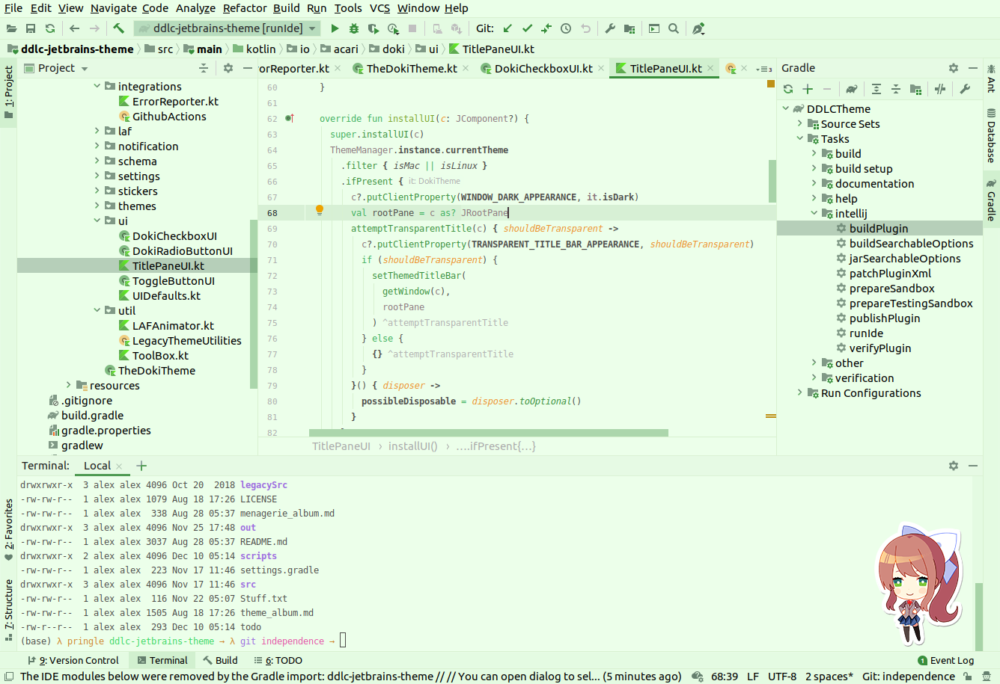
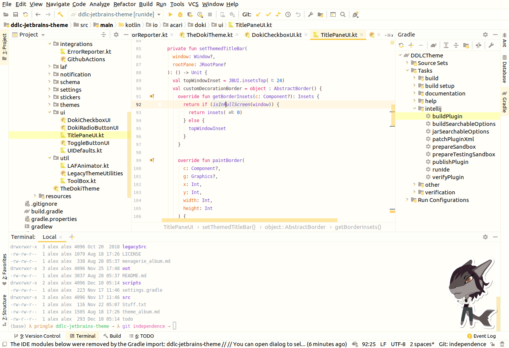
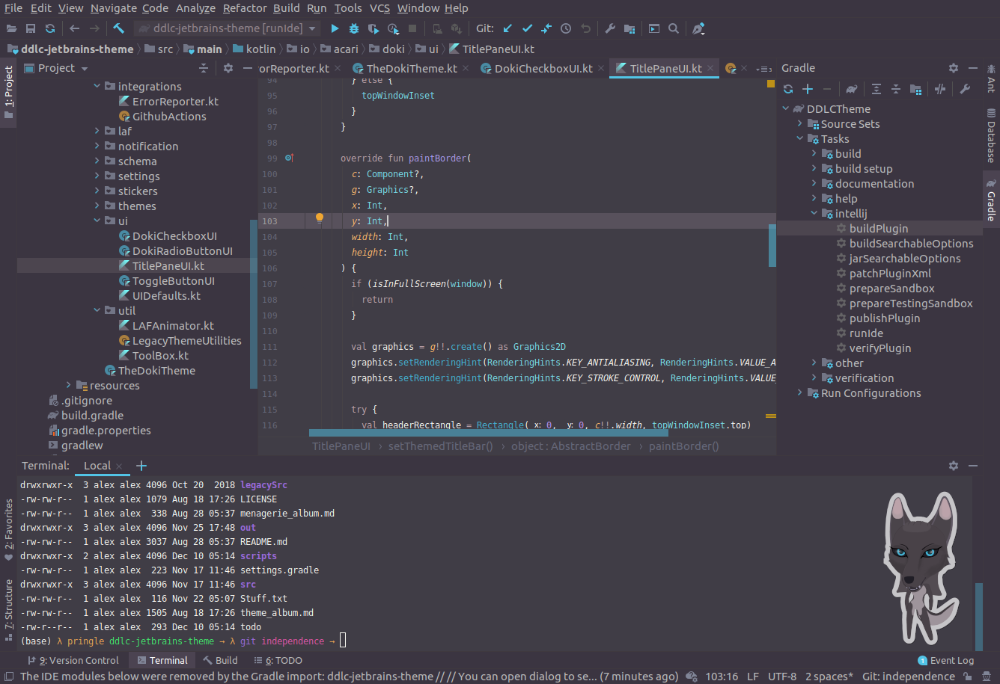

    </img>

---

    <h3 style="color: pink;">Ṱ͙̠͔́̈́͐̇h̳̳̗̘͂̇́̊e̮̰̼̮̿́̋͗ ̝͇͎̱̊̚̕͝o͙͈̼̜̓̀̉̀n͚̩̣̣̅̍̐̈́l̻̺̩̠͋̑̎͠y̧̱̘͕̿͐̎͘ ̧͎̹̙̓̅̈́͆t̢͔̩̮́̐̕͠h̨͓͔͉̿́͑͝é̹̙̤̮̀̍̈m̙̥̙̺̋̾͑̊e̳̗̖̩̽͐͆͒s͖̰͎̏̍̓̈́ͅ ͎̻͔͍͗͒̾̀y̢̻̜͎̾̄͒̋o̗̝̮̞͛̿̏͐ǔ̥̜̹̘̓̿̕ ̢̛̫͕͔̎̂́ẻ̲̜̰͙̍̌͑v̜̻̗̥̈́̓̈́̔e̡͚͇̫̎̆̋͑r̺̮͓̳̍̊͗̋ ̻̻̣̹͋͑́̈́ǹ̨̲͚͇̒̆͘e̗͉̫̱͂͑͗̓e̳̬̬͈̓̊̂͘d̪̻̞̮̈͂͠͝.͍͇͍̫̒͆̓͝</h3>

---

Hey! Before we go any further, I would like to ask you a couple of questions:

-  Do you need a bit more spice in your development life?
-  Are Light or Dark themes your thing?
-  Is your tolerance for all things moe, high?
-  Do you like stickers?
-  Is having a lot of choices a must?

Well look no further friend, **I've got what you are looking for!**

With over 15 themes (light and dark) I think you will be able to find your favorite.
You can even find one that fits your mood for the day.

Variety is the spice of life! So you can choose themes from the following Doki-Doki Theme Suites:

- Doki-Doki Literature Club
- Re:Zero
- Kill La Kill
- KonoSuba
- Mistress's Menagerie

Too distracted by the sticker in the corner of your IDE?
No worries! You can configure them to be on or off at your leisure.

These themes are easy to install, there are minimal configurations so you can enjoy the themes faster.
They also play well with other theme, so feel free to come an go as your mood changes :)

# Got Contributions, fun ideas, or issues?

Don't be afraid to reach out and join the [Gitter Community](https://gitter.im/doki-theme-jetbrains/community?utm_source=share-link&utm_medium=link&utm_campaign=share-link)!

## Enjoying the plugin and want more people to use it?

Great! I am glad you like it!

Be sure to share it with others who also may like it as well!

Also, giving it a good [review on the plugins page](https://plugins.jetbrains.com/plugin/10804-doki-doki-literature-club-theme) will help this plugin will become more visible to users!

## Not your thing or something bothering you?

Feel free to submit your feedback as [an issue](https://github.com/Unthrottled/ddlc-jetbrains-theme/issues/new).
Help make this plugin better! 

# Screen Samples!

## Literature Club (Sample):

# [More Literature club theme Screenshots!!](theme_album.md)

---
## Re:Zero (Sample):

# [More Re:Zero theme Screenshots!!](r0_album.md)

---
## Kill la Kill (Sample):

# [More Kill la Kill theme Screenshots!!](klk_album.md)

---
## KonoSuba (Sample):

# [More KonoSuba theme Screenshots!!](ks_album.md)

---

## Mistress's Menagerie (Sample):

# [More theme Screenshots!!](menagerie_album.md)

---
# Is the theme not working? Do things do not work the way you expect them to work?!

# 👇👇👇
# [Please see this page for help!](https://github.com/Unthrottled/ddlc-jetbrains-theme/wiki/Trouble-Shooting!) 👈👈
# ☝️☝️☝️

Enjoy!
---
##### You can also see the [project wiki](https://github.com/Unthrottled/ddlc-jetbrains-theme/wiki) for Doki-Doki theme specific information!
