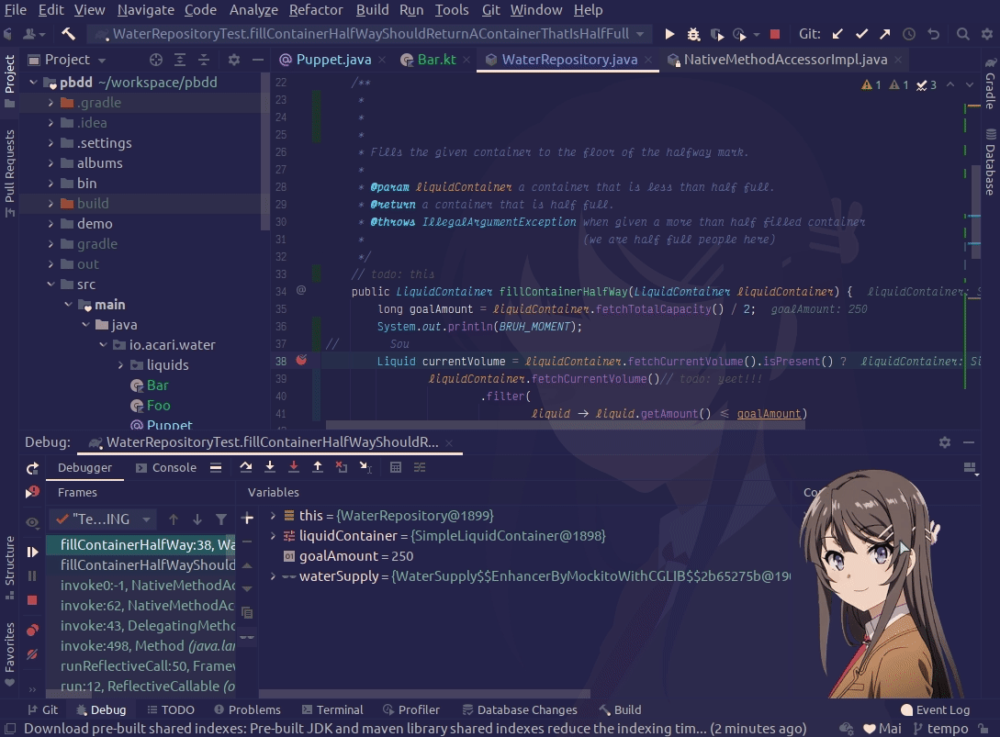
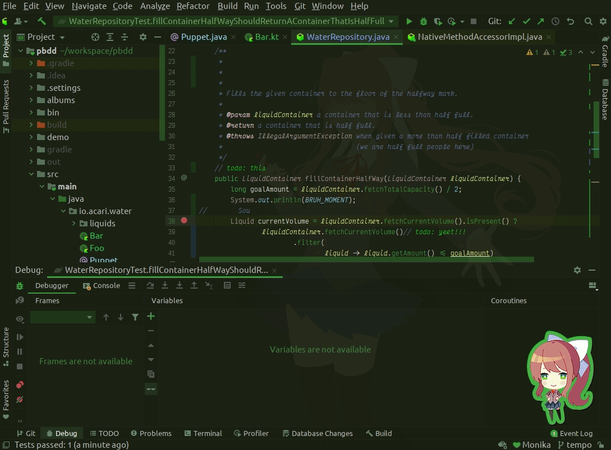
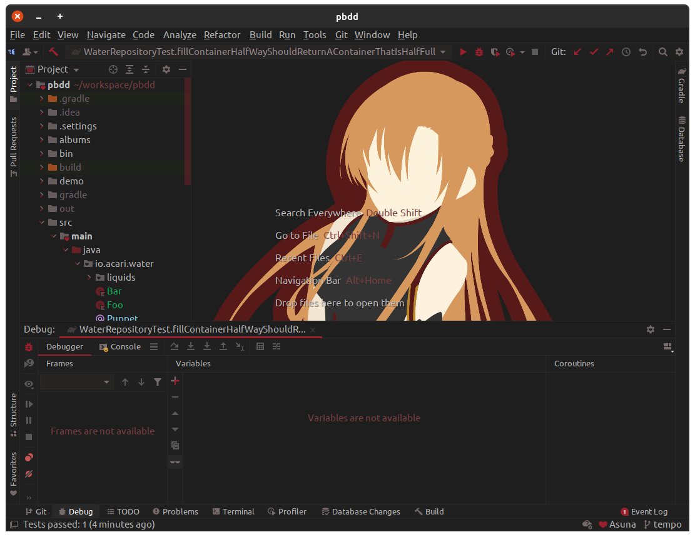
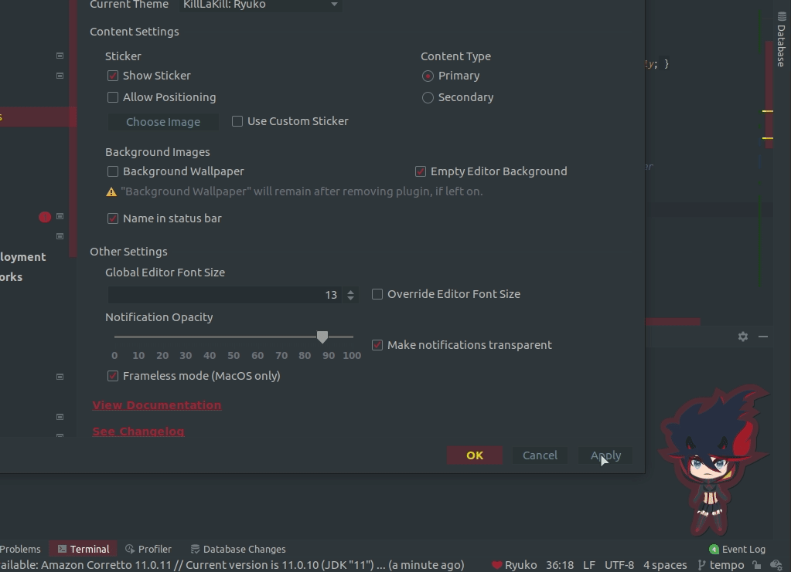
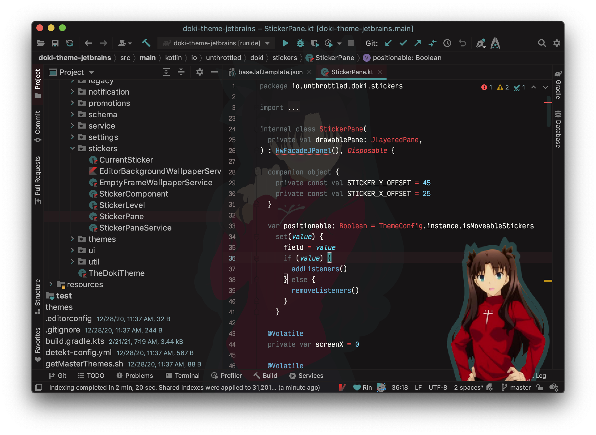

The Doki Theme: Jetbrains IDEs
---

## Quick Theme Preview

# [Complete Theme Album.](./albums/complete_theme_album.md)

Themes grouped [by anime](./albums/grouping.md)

---

This plugin is for serious Otaku programmers.
Code with your waifu. With over **50** themes,
I think you will find best girl.

You can choose themes from various, Anime, Manga, or Visual Novels:

- Blend S
- Daily Life with a Monster Girl
- DanganRonpa
- Doki-Doki Literature Club
- Don't Toy With Me, Miss Nagatoro
- Fate/Type-Moon
- Future Diary
- Gate
- High School DxD
- Kakegurui
- Kill La Kill
- KonoSuba
- Love Live!
- Lucky Star
- Miss Kobayashi's Dragon Maid
- Monogatari
- Neon Genesis Evangelion
- OreGairu
- Quintessential Quintuplets
- Re:Zero
- Steins Gate
- Sword Art Online
- Yuru Camp

## Installation

- Using IDE built-in plugin system:

  <kbd>Preferences</kbd> > <kbd>Plugins</kbd> > <kbd>Marketplace</kbd> > <kbd>Search for "The Doki Theme"</kbd> >
  <kbd>Install Plugin</kbd>

- Manually:

  Download the [latest release](https://github.com/doki-theme/doki-theme-jetbrains/releases/latest) and install it manually using
  <kbd>Preferences</kbd> > <kbd>Plugins</kbd> > <kbd>⚙️</kbd> > <kbd>Install plugin from disk...</kbd>

---

# Documentation

- [Configuration](#configuration)
  - [General Settings](#general-settings)
    - [Content Settings](#content-settings)
      - [Stickers](#sticker)
      - [Content Type](#content-type)
      - [Background Images](#background-images)
      - [Suggestive Content](#suggestive-content)
      - [Misc Content Settings](#misc-content-settings)
    - [Other Settings](#other-settings)
- [Miscellaneous](#miscellaneous)
  - [Contributing](#contributing) 
  - [Quick Theme Switch](#quick-theme-switch)
  - [Theme Requests](#theme-requests)
  - [Helping the community](#enjoying-the-plugin)
  - [Feature Requests](#contributions)
  - [Frequent Updates](#release-channel)
  - [Changelog](#changelog)

# Configuration

You can access the settings menu here: 

<kbd>Preferences</kbd> > <kbd>Appearance & Behavior</kbd> > <kbd>Doki Theme Settings</kbd>

## General Settings

**Current Theme** allows you to change the look and feel of your IDE with one of the plugin's supplied themes.

### Content Settings

This allows you to control the decoration of your IDE.

You can be a conservative weeb or an obvious otaku. 
Customize to your heart's content!

#### Sticker

**Show sticker** allows you to control the presence of the cute sticker in the bottom right-hand corner of your IDE.

**Allow Positioning** allows you to move your cute sticker out of the way when you need to read the logs.
You won't be able to click through the sticker though, so you'll need to move it or toggle this action.

**Use Custom Sticker** allows you to be able to set the image to be used for all the doki-themes.
Allowed image types: jpg, png, gif

#### Content Type

Some themes have more than one set of images, this allows you to switch in-between each of them.

Themes that have more than one sticker:

- Hatsune Miku
- Sakurajima Mai
- Kanna Kamui
- Izumi Konata
- Just Monika (Light/Dark)
- Sayori (Light/Dark)
- Natsuki (Light/Dark)
- Yuri (Light/Dark)
- Rias (Onyx)

  

#### Background Images

**Background Wallpaper** is probably one of the best features of the plugin.
This feature will set the background image to the current theme's official wallpaper.

> Important: When this feature is enabled, if the plugin is uninstalled, the wallpaper will
> remain. You can turn off this feature or use the `Set Background Image` action to adjust.

**Empty Editor Background** sets the background image of the frame, 
that appears when all tabs are closed, with the current theme's official wallpaper.

#### Suggestive Content

    </img>

So I thought it was a good idea to add a bit of culture to this plugin.
Ya boi is horny on main.

I will give you a bit of a warning before you install suggestive content.
Some of us are professional Otaku, who want to remain, well...professional.
Don't worry if you choose to continue, I won't ask you again for that specific theme.

Applies for the following content:

- Rias Onyx: Secondary Content

#### Misc Content Settings

**Name in status bar** will put the name of the character, your current theme is based on, in the status bar. 

### Other Settings

**Global Editor Font Size** will override any/all font size settings for your code editor font size.
This only applies to any Doki Themes. You must enable the `Override Editor Font Size` for this feature to take effect.

**Notification Opacity:** Are you tired of pesky notifications covering up your waifu?
I know I was, now you can fix that problem. You are free to adjust the opacity of the notification window as you please.
You can hit `Apply` to test out your new settings!

**Frameless Mode** is a feature only available on MacOS, and gives your IDE the frameless look and feel.

**Theme Change Animation** enables the neat fade-in animation effect as you change your theme.
You can see a rough example in the [quick theme switch section.](#quick-theme-switch)

# Miscellaneous

## Contributing

If you want to get your workstation set up to work on the plugin.
Then you'll want to checkout the [CONTRIBUTING.md](./CONTRIBUTING.md) for instructions on what is needed.

## Quick Theme Switch

You've got a ton of new themes now, and you want to take a quick peek at each of them.
Well you can use the [Quick Switch Scheme](https://www.jetbrains.com/help/idea/switching-between-schemes.html)
to browse the `Look and Feel`.

## Theme Requests

If you want your main squeeze to be featured in the Doki Theme suite, feel free to [submit a theme request](https://github.com/doki-theme/doki-master-theme/issues).

## Enjoying the plugin?

Great! I am glad you like it!

Be sure to ⭐ and share it with other weebs!

Also, giving it a good [review on the plugins page](https://plugins.jetbrains.com/plugin/10804-doki-doki-literature-club-theme) will help this plugin become visible to more otaku!

## Contributions?

I think your voice needs to be heard! You probably have good ideas, so feel free to submit your feedback as [an issue](https://github.com/doki-theme/doki-theme-jetbrains/issues/new).

Help make this plugin better!

## Release channel

Want updates sooner? I have a [canary release channel](https://github.com/Unthrottled/jetbrains-plugin-repository) that you can set up to get the latest and greatest!

## Changelog

Did you know I keep a changelog?
[You can find it here!](./changelog/CHANGELOG.md)

---

    </img>

