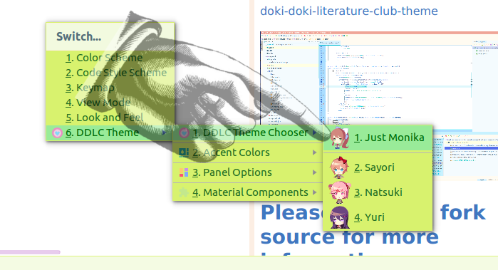
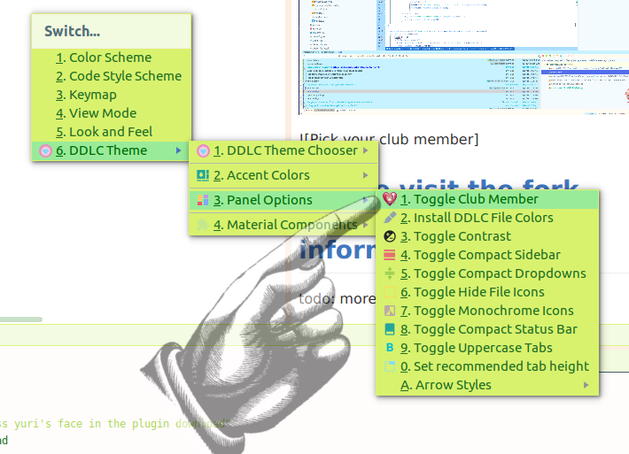

</img>

# Doki Doki Theme for Jetbrains

Plugin page:
https://plugins.jetbrains.com/plugin/10804-doki-doki-literature-club-theme

Getting Set Up
---
## Choosing the right club member

By default, once the plugin is installed, the default color scheme is currently applied.
Depriving you of the full DDLC experience.

To alleviate your issues just go to 

#### Tools -> DDLC Theme -> DDLC Theme Chooser

And pick out your _favorite_ club member.

## DDLC Chibis

By default, the theme automatically gives you your favorite club member in the bottom right-hand corner.

If you ever need to be productive, you can hide them using the panel option

#### Tools -> DDLC Theme -> Panel Options -> Toggle Club Member

> Be sure to install the DDLC file colors as well!

## [Please visit the fork source for more information](https://github.com/ChrisRM/material-theme-jetbrains)

Enjoy!
---
